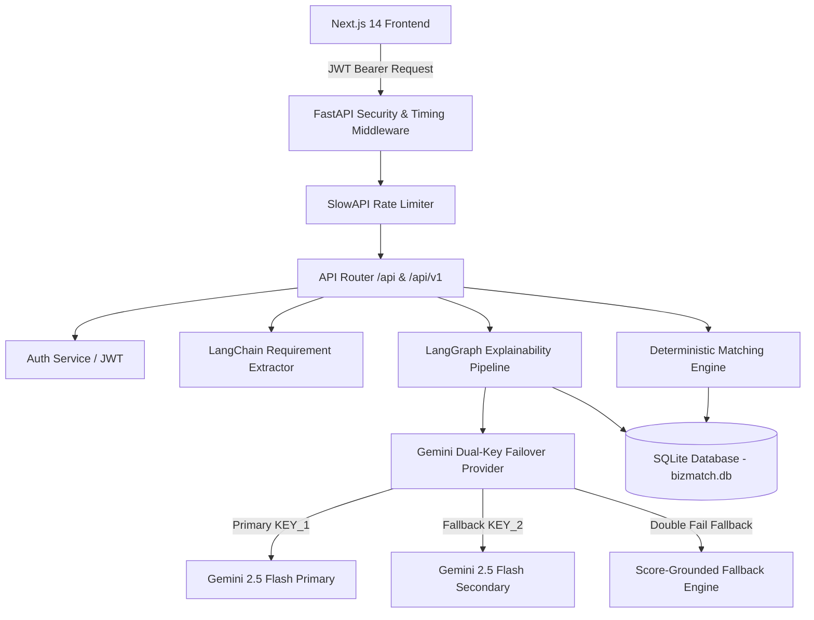

# BizMatch AI — Explainable Executive Matching Engine

[](https://github.com/iammarafzal/BizMatch_AI_Pak_Angels_Hackathon)
[](https://fastapi.tiangolo.com/)
[](https://nextjs.org/)
[](https://www.sqlite.org/)
[](https://python.langchain.com/)

> **BizMatch AI** is a high-velocity, explainable decision-support platform that connects early-stage startups and high-growth businesses with vetted fractional and full-time executive leaders (Operations, Product, Tech, Growth).

---

## 🌟 Key Highlights & Architectural Guardrails

- **📊 Deterministic 6-Factor Matching Engine**: Multi-dimensional candidate evaluation using a weighted formula strictly isolated from LLM output:
  $$\text{Score} = 0.20 \cdot \text{Industry} + 0.25 \cdot \text{Skills} + 0.20 \cdot \text{Experience} + 0.15 \cdot \text{Leadership} + 0.10 \cdot \text{Stage} + 0.10 \cdot \text{Salary}$$
- **🛡️ Resilient Dual-Key Gemini Failover**: `GeminiClientManager` manages primary (`GEMINI_API_KEY_1`) and secondary (`GEMINI_API_KEY_2`) keys, transparently failing over on 429 rate limits or quota exhaustion with a score-grounded fallback guarantee (0% unhandled 500 errors).
- **🤖 LangGraph Explainability & Responsible AI Audit**: StateGraph workflow producing structured decision support cards containing strengths, trade-off concerns, missing requirements, and verdicts, sanitized against demographic bias.
- **🔐 Enterprise Security & Auth**: Standard JWT access tokens, bcrypt password hashing, Role-Based Access Control (RBAC: `FOUNDER`, `ADMIN`), SlowAPI rate limiting (60 req/min), and security headers (`X-Content-Type-Options: nosniff`, `X-Frame-Options: DENY`, `Strict-Transport-Security`, `X-Request-ID`, `X-Process-Time`).
- **⚡ One-Click Demo Preset**: Instant preset hydration for **FashionCart** ($2,000/mo budget) matching against benchmark candidates like **Sarah Khan** (Operations Lead, 92.8% match).
- **💾 Zero-Dependency SQLite Integration**: Instant cloning and zero-configuration database setup (`sqlite:///./bizmatch.db`) with automatic table creation and startup auto-seeding.

---

## 🏗️ System Architecture



---

## 🛠️ Tech Stack

- **Backend Framework**: Python 3.11+, FastAPI, Uvicorn, Pydantic V2
- **Database & ORM**: SQLite (Native Zero-Dependency), SQLAlchemy 2.0
- **AI Orchestration**: LangChain, LangGraph StateGraph, Google Gemini 2.5 Flash
- **Frontend Framework**: Next.js 14 (App Router), React, TailwindCSS, Lucide Icons
- **Security & Reliability**: JWT (PyJWT), bcrypt, SlowAPI, CORS Middleware, Custom Logging & Security Middleware
- **Testing & Verification**: Pytest, AsyncClient (httpx), Custom Automated Verification Suites

---

## 🚀 Quick Start Guide

### Prerequisites
- **Python 3.11+**
- **Node.js 18+** & `npm`
- **Zero Database Server Setup**: Native SQLite is built into Python!

---

### 1. Backend Setup

```bash
# Navigate to backend directory
cd backend

# Create & activate virtual environment
python -m venv venv
# On Windows PowerShell:
.\venv\Scripts\Activate.ps1
# On macOS/Linux:
source venv/bin/activate

# Install dependencies
pip install -r requirements.txt

# Configure environment variables
cp .env.example .env
# Edit .env and set your GEMINI_API_KEY_1 and GEMINI_API_KEY_2 keys
```

#### Environment Variables (`.env`)
```env
PROJECT_NAME="BizMatch AI"
API_V1_STR="/api"
DATABASE_URL="sqlite:///./bizmatch.db"

GEMINI_API_KEY_1="your_primary_gemini_api_key"
GEMINI_API_KEY_2="your_secondary_gemini_api_key"

SECRET_KEY="super_secret_bizmatch_key_2026_jwt_token_auth"
ALGORITHM="HS256"
ACCESS_TOKEN_EXPIRE_MINUTES=60
```

#### Database Seeding *(Automatic on Boot)*
> The server automatically creates all database tables and seeds candidate managers on application boot if empty.
```bash
# Optional: Force reset and re-seed all candidate managers and businesses:
python seed.py --reset
```

#### Run Backend Server
```bash
uvicorn app.main:app --reload --port 8000
```
*or via python:*
```bash
python main.py
```
- API Base URL: `http://localhost:8000`
- Swagger UI Documentation: `http://localhost:8000/docs`

---

### 2. Frontend Setup

```bash
# Navigate to frontend directory
cd ../frontend

# Install dependencies
npm install

# Run development server
npm run dev
```
- Web Application: `http://localhost:3000`

---

## 🔑 Demo User Credentials

| Role | Email | Password | Access Level |
| :--- | :--- | :--- | :--- |
| **Founder** | `founder@bizmatch.ai` | `password123` | `FOUNDER` |
| **Admin** | `admin@bizmatch.ai` | `admin123` | `ADMIN` |

---

## 📡 API Endpoint Reference

### Authentication & Access Control
| Method | Route | Description | Auth Required |
| :--- | :--- | :--- | :--- |
| `POST` | `/api/auth/register` | Register a new FOUNDER or ADMIN user | No |
| `POST` | `/api/auth/login` | Authenticate credentials & issue JWT token | No |
| `GET` | `/api/auth/me` | Retrieve current authenticated user profile | Bearer Token |

### Base & One-Click Demo
| Method | Route | Description | Auth Required |
| :--- | :--- | :--- | :--- |
| `GET` | `/health` | API health & database status check | No |
| `GET` | `/api/demo/fashioncart` | Retrieve FashionCart preset data ($2,000 budget) | No |

### Business Profile Management
| Method | Route | Description | Auth Required |
| :--- | :--- | :--- | :--- |
| `GET` | `/api/businesses/` | List all businesses | No |
| `POST` | `/api/businesses/` | Create a new business profile | Bearer Token |
| `GET` | `/api/businesses/{id}` | Get business details by ID | No |
| `POST` | `/api/businesses/analyze-requirements` | LangChain natural language requirement extraction | No |

### Manager Candidate Directory
| Method | Route | Description | Auth Required |
| :--- | :--- | :--- | :--- |
| `GET` | `/api/managers/` | List candidate managers (supports `limit`) | No |
| `GET` | `/api/managers/{id}` | Get candidate manager details by ID | No |

### Matching & Decision Support Engine
| Method | Route | Description | Auth Required |
| :--- | :--- | :--- | :--- |
| `POST` | `/api/matches/calculate` | Compute 6-factor match scores for candidate pool | Bearer Token |
| `POST` | `/api/matches/explain` | LangGraph explainability & decision support card | Bearer Token |
| `GET` | `/api/matches/{business_id}` | Retrieve persisted historical match records | No |

> *Note: All endpoints are also accessible under the `/api/v1/...` prefix.*

---

## 🧪 Comprehensive Testing & QA Suites

Run the backend verification suite to validate system integrity:

```bash
cd backend

# 1. Run Complete Pytest Suite
python -m pytest tests/ -v

# 2. Live API Endpoint QA Suite
python scripts/verify_all_endpoints.py

# 3. Security, Authorization & Dual-Key Failover Audit
python scripts/verify_security_and_resilience.py

# 4. End-to-End 5-Step Demo Journey Validation
python scripts/verify_e2e.py
```

---

## ⚖️ Human-in-the-Loop & Responsible AI Disclaimer

> **BizMatch AI** operates strictly as an explainable decision-support platform. All matching scores, factor breakdowns, and generated decision support cards provide advisory trade-off analysis to empower founders. Final hiring, interview, and selection decisions remain exclusively with human leaders.